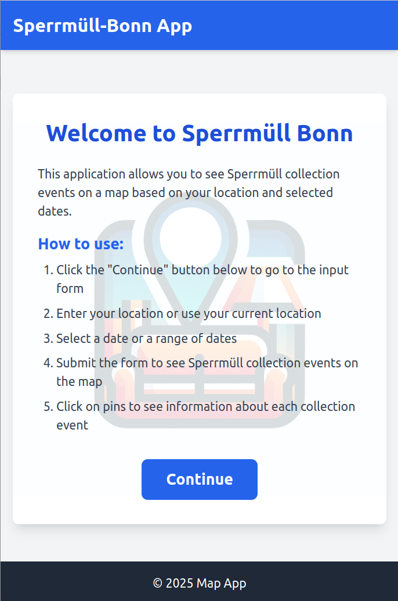
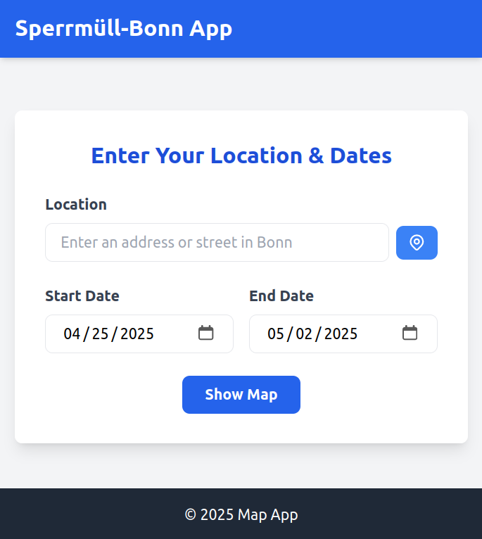
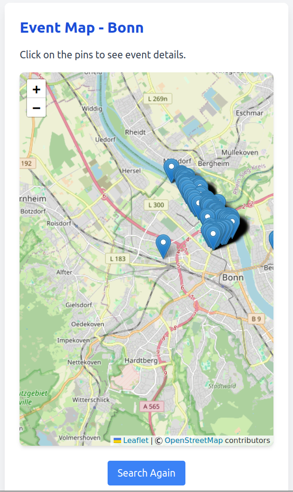

# spermull-bonn

Web app for finding **Sperrmüll** (bulky waste) pickup schedules in Bonn,
powered by open city data from the city of Bonn.

## Versions

This project exists in two parallel forms in the same repository:

| Branch | Tech | Hosting |
|---|---|---|
| `main` | Flask (Python server) | Self-hosted server |
| `static-version` | Pure HTML/JS, no backend | GitHub Pages |

The Flask version (`main`) supports address autocomplete and live date-range
queries against a pre-built msgpack index.\
The static version (`static-version`) serves pre-built GeoJSON and runs
entirely in the browser — no server required.

## Installation & running

See [INSTALL.md](INSTALL.md) for full setup instructions.

## Screenshots

